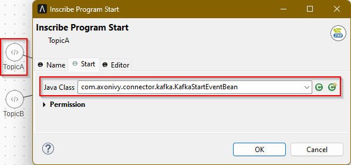
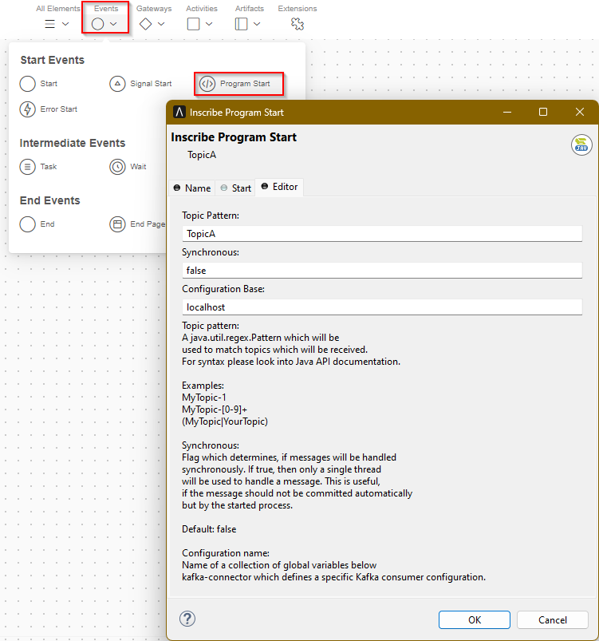

# Apache Kafka Connector

[Apache Kafka](https://kafka.apache.org/)  is a distributed streaming platform that allows you to publish and subscribe to streams of records. It is designed to handle large volumes of real-time data streams and can be used to implement real-time streaming data pipelines and applications. Kafka is commonly used for use cases such as data integration, real-time analytics, and log aggregation - especially when large amounts of data are involved.

The Apache Kafka Connector from Axon Ivy helps you accelerate your process automation by providing access to the features of Apache Kafka.

This connector:

- Is based on the [Apache Kafka API](https://kafka.apache.org/34/javadoc/).
- Provides you with access to one or more Apache Kafka message-handling servers or clusters.
- Supports schema registry.
- Allows you to define multiple connection configurations.
- Creates `Consumer` or `Producer` instances.
- Offers an `IProcessStartEventBean` that can be used to start Ivy processes that process Apache Kafka messages synchronously or asynchronously.
- Supports you with a demo implementation to reduce your integration effort.

## Demo

The demo provides a dialog with buttons for sending messages to different
Apache Kafka *topics*. You may enter a `key` and a `value` but it is ok,
to use the same key and value for multiple messages.

*PersonTopic* is a special topic which sends and receives `Person` objects,
with a schema supplied by a schema-registry. Note, that this demo requires
access to a schema-registry. The docker setup provided can be used to test
the schema registry integration.

To see the effect of sending messages you have multiple options:

### Apache Kafka command line

Start a console consumer on the command line of a machine connected to
the Apache Kafka server and see messages appearing on the console directly.

```
kafka-console-consumer --bootstrap-server localhost:9092 --topic TopicA
```
Type `kafka-console-consumer --help` for usage.

### KafkaStartEventBean

The demo also contains examples of using a `KafkaStartEventBean`. Whenever
    you send a message from the Demo GUI, it will be received by one of the 
Demo listeners (which log them into the Runtime log).

### Other tools

On the web you will find stand-alone tools like [Offset Explorer](https://www.offsetexplorer.com)
or web-based tools. Please note the licence conditions.

## Setup

### Apache Kafka in Docker

If you do not have access to an existing Apache Kafka server, but have Docker installed, you can quickly start
an example setup including a schema registry by using our example
[docker-compose.yml](https://github.com/axonivy-market/kafkaConnector/blob/master/kafkaConnector-product/files/docker-compose.yml) file.

Copy this file to a directory on your machine, `cd` to that directory and enter the command:

```
docker-compose up -d
```

Docker will start a `zookeeper` server on port `2181`, a `kafka` server on port `9092` and a `schema-registry` server on port `9081`. To connect to the kafka server, use `localhost:9092` as your bootstrap server and
`http://localhost:9081` as your schema registry server. Note, that the demo is configured to use these servers
out of the box.

## Usage

The connector was built to give you as much access as possible to the original
[Apache Kafka API](https://kafka.apache.org/34/javadoc/) while providing some
useful semantics for use in the Axon Ivy environment.

All functionality is exposed in `KafkaService` or in sub-process of this connector.
The connector offers functions to easily create `Consumer`s and `Producer`s based
on global veriable configurations. `Producer`s are cached and re-used for efficiency
reasons. `Consumer`s are not cached. The best way to consume messages is to use
the provided `KafkaStartEventBean` which will use a single `Consumer` for listening on
a topic pattern.

### Sending

Objects can be sent using the provided send sup-process or directly by using the `send` convenience
function provided by the `KafkaService` As defined by the Kafka API, the result of *sending* a message
to the Kafka server can be monitored in two ways.

1. Sending provides a `Future` which you can
`get()` immediately (blocking) or at a later point in time.
2. Sending accepts an optional `Callback` supplied by the caller.

This connector supports both options and will use the `callback` if it is not `null`.

Note, that callbacks run in a `Thread` created by Kafka and will not have access to
Ivy functionality. A convenience function `KafkaService.ivyCallback()` is provided to
create callbacks with access to the Ivy environment (except to functionality which is
related to the current request as this request is not valid outside of the request thread).

If you want to use send callbacks with Ivy functionality you should probably just send a signal
and do more sophisticated Ivy stuff in a separate Ivy signal handler. Note: The convenience function currently uses a non-public Ivy API.

### Receiving

An `KafkaStartEventBean` for use in an Ivy *Program start* element is provided to listen
to topic patterns and start Ivy processes. Select this bean in the *Start* tab of a *Program start*
element:



Configure some additional properties in the *Editor* tab of the *Program start* element:



**Topic Pattern**
Enter a valid `java.util.regex.Pattern` for the topic(s) to listen to. Note, that words without
special chararcters are valid patterns. So there is no need to learn a special syntax to listen
to simple topic names. Note, that topic patterns are case sensitive.

**Synchronous**
When a message is received, will the bean wait until the started process gives back control
(synchronous) or continue to receive messages in parallel (asynchronous)? All asynchronous
beans share a single thread pool and the size of this pool is configured globally. Synchronous
beans will use their own thread. In the default configuration, messages are commited automatically.
If you want to commit messages yourself, you might want to switch to synchronous mode and
use the supplied consumer to commit the message offset. Possible values are `true` or `false`.
Everything which does not evaluate to `true` (in Java `Boolean.valueOf(String)`) will be considered
`false` which is also default (asynchronous message handling).

**Configuration name**
The name of a group of global variables below this path to use as properties for
construction of a `Consumer`.

#### Accessing the data

When a message is received, the process start will be fired and the following variables
in your data class will be set to the values received. Note, that your data-class must provide
these with the correct type:

**consumer**
This is the `Consumer` which received the message. It can be used
to commit a message, for example.
The type of the `consumer` field must be `org.apache.kafka.clients.consumer.Consumer`.

**consumerRecord**
This is the `ConsumerRecord` received by the consumer. It might
contain a `key` and a `value` and gives you access to the `topic` and `offset`.
Note, that the `consumerRecord` delivers `key` and `value` as `Object` type.
If you configured a special Kafka Deserializer you will have to cast the
received objects manually to the correct type.
The type of the `consumerRecord` field must be `org.apache.kafka.clients.consumer.ConsumerRecord`.

#### Giving back control after handling a message

When a thread (process) is handling a received message, it will be occupied until the
process ends or the task is suspended. It is good practice to avoid blocking a
process for a long time. If you need to do sophisticated, time-consuming operations,
consider sending a signal to start another process to do this work

Note, that `Consumer`s handle message queueing, so no messages will be missed, even if
all threads are currently busy. As soon as a thread is free, the next message will be
handled.

### Sending and receiving objects following a schema (using the schema registry)

This connector also supports sending and receiving objects defined in a scheme
registered at a schema registry server. Currently, the AVRO scheme is supported
directly by the connector. Setup of such a configuration can be found
[on the internet](https://docs.confluent.io/platform/current/schema-registry/fundamentals/serdes-develop/serdes-avro.html) and the needed properties can be defined as global variables in the
same way as for non-schematic sending and receiving.

To work with schemas, create a schema (e.g. `person.avsc`) and let Maven create
the Java classes for that schema. The `pom.xml` file of the demo project shows an example of
running the source generation. Source is generated by starting the build with the `generate-avro`
profile:

```
mvn generate-sources -Pgenerate-avro
```

If your schema registry is set-up to automatically accept a new schema, you can directly
send objects to Kafka.

#### Receiving GenericData records

If the global `specific.avro.reader` is set to `false`, AVRO will deserialize messages into
`GenericData.Record`s. This is a generic object offering convenience methods to access fields,
arrays or even sub-records easily. For simple objects, this approach is well suited.

#### Receiving Java objects

If the global `specific.avro.reader` is set to `true`, AVRO will deserialize messages into
objects created by the maven step described earlier. There is a caveat though. The
classes returned must be available in the classpath, when a message is received.

Technically, if a class is used for the first time in a sub-process of the connector
(i.e. for sending) and later you want to deserialize into this class, it will not be
found again. This is because of the Kafka caching mechanism and Ivy specific classloader
handling of projects.

As a solution, if you experience the problem for one of your classes, switch to the
convenience Java call for sending or create a sub-process in your own project. An example
for sending and receiving objects is shown in the demo project.

### Creation of Producer and Consumer

In some complex environments (and so also in Ivy) Kafka sometimes is not able to access the
correct class loader to create `Consumer`s and `Producer`s. This connector provides convenience
functions `consumer()` and `producer()` to work around this problem in the `KafkaService` class
and can also be used to create specific `Consumer`s and `Producer`s not under control by the
connector caching mechanism directly via a set of properties.

Additionally the `KafkaStartEventBean` accepts the name of a `Consumer` supplier that allows the
use of `Consumer`s created in some different way.

### Configuration

Configuration can be done in global variables where some simple inheritence mechanism
is provided. All Kafka configuration is stored below the `kafkaConnector` global
variable. At this level you should configure the following global settings.

**workerPoolSize** Number of worker threads shared by all consumers to handle Kafka messages in parallel.

**pollTimeoutMs** Consumer polling time in ms. Note, that messages are always received immediately.
This timeout value defines the poll interval. Also it will be the maximum time needed to automatically
detect configuration changes (change of `configId`).

#### Property blocks and inheritence

The configuration supports multiple-instances. It contains property blocks below configuration names. For example, the settings contained in the block `kafkaConnector.localhost` will be used, when a prodcuer is created with `KafkaService.get().createProducer("localhost")`.

All settings (except the setting `inherit`) below this name will be collected into a `Properties` object
and passed to the constructor of the Kafka consumer or producer objects.

The special setting `inherit` can be used to reference another configuration block that can be used and
overridden. (Inheritence is recursive and will check for invalid loops.) The connector defines
a `defaultConfig` block with some common settings. It usually makes sense to inherit your configuration from 
this block. For an example of a simple configuration which inherits from the `defaultConfig` configuration,
have a look at the demo project!

The special setting `configId` is used to detect changes in the configuration. The actual value put there
does not matter, it can be a simple number or some text or even a timestamp. Whenever this value changes,
all producers and consumers affected by the change will be re-created automatically to reflect the new
configuration. Producers will react at the next send, consumers will react when a new message is received
(by the old configuration) or automatically, whenever a new poll occurs (which is defined by `pollTimeoutMs`).
Note, that the `configId` can be inheritted, so changing it for a single configuration will only update
producers and consumers for this specific configuration while updating the `defaultConfig` will update all
producers and consumers.
