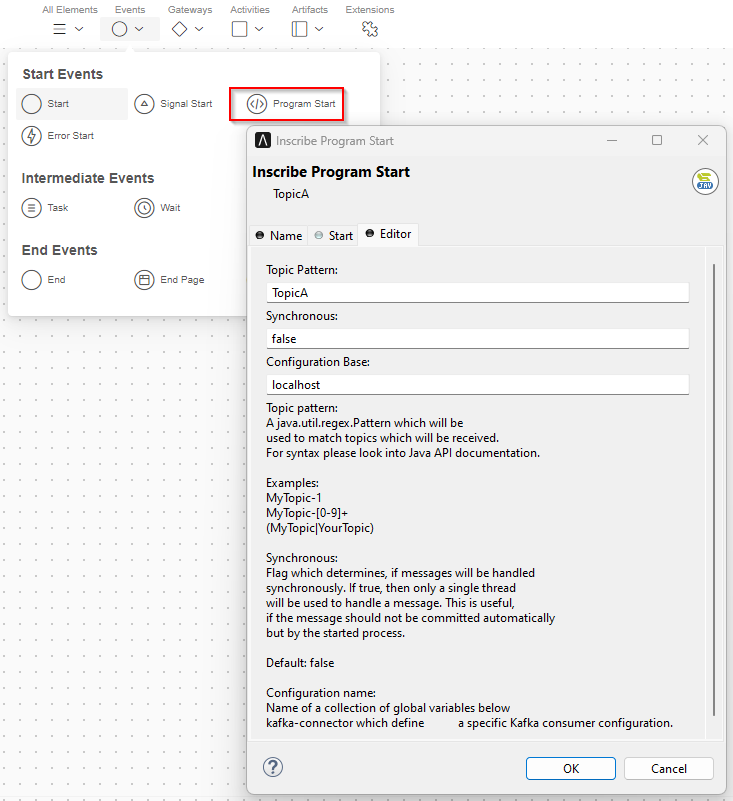

# Apache Kafka Connector

Connect to [Apache Kafka](https://kafka.apache.org).

This connector gives you access to one or more Apache Kafka message
handling servers or clusters. It allows you to define multiple,
inheriting connection configurations and lets you quickly create
a `KafkaConsumer` or a `KafkaProducer`.

Additionally, this connector provides an `IProcessStartEventBean` which
can be used to start Ivy processes which react on Apache Kafka messages
synchronously or asynchronously. 

## Demo

The demo provides a dialog with buttons for sending messages to different
Apache Kafka *topics*. You may enter a *key* and a *value* but it is ok,
to use the same key and value for multiple messages.

To see the effect of sending messages you have multiple options:

### Apache Kafka command line

Start a console consumer on the command line of a machine connected to
the Apache Kafka server and see messages appearing on the console directly.

```
kafka-console-consumer --bootstrap-server localhost:9092 --topic TopicA
```
Type `kafka-console-consumer --help` for usage.

### KafkaStartEventBean

The demo also contains examples of using a `KafkaStartEventBean`. Whenever
you send a message from the Demo GUI, it will be received by one of the
Demo listeners (which log them into the Runtime log).

### Other tools

On the web you will find stand-alone tools like [Offset Explorer](https://www.offsetexplorer.com) [^1]
and web-based tools. Please note the licence conditions.

## Setup

### Apache Kafka in Docker

If you do not have access to an existing Apache Kafka, you may quickly start one
in a docker container. You may want to use the provided docker compose file
[docker-compose.yml](files/docker-compose.yml) as a starter.

Copy this file to your machine and `cd` to the directory containing this file.
Enter there the command

```
docker-compose up -d
```

and docker will start a `zookeeper` server on port 2181  and a `kafka` server on port 9092. To
connect to this server, use `localhost:9092` as your bootstrap server. Note, that the demo
is configured to connect to this server.

## Usage

The connector was built to give you as much access as possible to the original
[Apache Kafka API](https://kafka.apache.org/34/javadoc/) while providing some
useful semantics for use in Axon Ivy.

### KafkaStartEventBean

An `KafkaStartEventBean` for use in an Ivy *Program start* element is provided to listen
to topics and start Ivy processes. This bean needs to be configured.



**Topic Pattern**
Enter a valid `java.util.regex.Pattern` as the topic to listen to. Note, that words without
special chararcters are valid patterns. So there is no need to learn a special syntax to listen
to simple topic names. Topic patterns are case sensitive

**Synchronous**
When a message is received, will the bean wait until the started process gives back control
(synchronous) or continue to receive messages in parallel (asynchronous)? All asynchronous
beans will share a single thread pool which can be configured globally. Synchronous beans
will use their own thread. In the default configuration, messages are commited automatically.
If you want to commit messages yourself, you might want to switch to synchronous mode and
use the supplied consumer to commit the message offset. The defaul value is **false** which
means asynchronous message handling.

**Configuration name**
The name of a block of global variables to use as properties for construction a
`KafkaConsumer`.

#### Accessing the data
When a message is received, the process start will be fired and if your data class
provides the necessary variables, they will be filled in:

**consumer**
This is the `KafkaConsumer` which received the message. It can be used
to commit a message, for example.

**consumerRecord**
This is the `ConsumerRecord` received by the consumer. It might
contain a `key` and a `value` and gives you access to the `topic` and `offset`.
Note, that the `consumerRecord` delivers `key` and `value` as `Object`.
If you configured a special Kafka Deserializer you will have to cast the
received objects manually to the correct type.

#### Giving back control after handling a message
A receiving thread will be freed, when the process that was fired by a message
gives back control. This is the case when the process ends or when a task is
suspended. To reduce waiting time, you might also send a signal or similar.
Note, that the `KafkaConsumer` handles message queueing so no messages will be
missed, even when all threads are currently used. Also message ordering is
kept at all times.

### Creation of KafkaProducer and KafkaConsumer
In some bigger environments (and so also in Ivy) there is a known Kafka topic,
where Kafka will not be able to access the correct class loader to create a
`KafkaConsumer` or `KafkaProducer`. This connector provides convenience
functions `createConsumer` and `createProducer` to work around this problem
in the `KafkaService` class. These functions will create these objects either
by the name of their gloabl variable configuration or directly via a set of properties.

Additionally you might implement and configure your own consumer supplier for your
`KafkaStartEventBean` in case the built in solution does not handle your case well.

### Configuration
Configuration can be done in global variables where some simple inheritence mechanism
is provided. All Kafka configuration is stored below the `kafka-connector` global
variable. At this level you should configure the following global settings.

**workerPoolSize** Number of worker threads shared by all consumers to handle Kafka messages in parallel.

**pollTimeoutMs** Consumer polling time in ms. Note, that messages are always received immediately. This is only the blocking timeout of the poll function.

#### Property blocks and inheritence
Other than that, the configuration contains property blocks below configuration names. For example, the
settings contained in the block `kafka-connector.localhost` will be used, when a prodcuer is created with
`KafkaService.get().createProducer("localhost")`.

All settings (except the setting `inherit`) below this this name will be collected into a `Properties` object and passed to the constructor of the Kafka consumer or producer objects.

The special setting `inherit` can be used to reference another configuration block that can be used and
overridden by a block. (Inheritence is recursive and will check for invalid loops.) The connector defines
a `default` block with some common settings. It usually makes sense to inherit your configuration from 
this block. For an example of a simple configuration, please have a look at the demo project.
