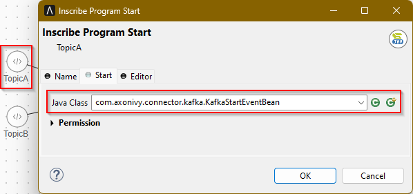
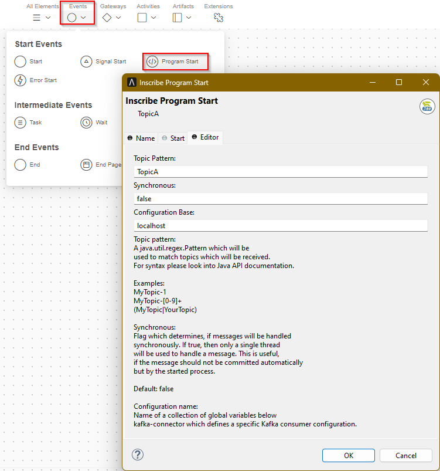

# Apache Kafka Connector

[Apache Kafka](https://kafka.apache.org/) ist eine verteilte
Streaming-Plattform, mit der Sie Datensatz-Streams veröffentlichen und
abonnieren können. Sie ist für die Verarbeitung großer Mengen von
Echtzeit-Datenströmen ausgelegt und kann zur Implementierung von
Echtzeit-Streaming-Datenpipelines und -Anwendungen verwendet werden. Kafka wird
häufig für Anwendungsfälle wie Datenintegration, Echtzeitanalysen und
Protokollaggregation eingesetzt – insbesondere wenn es um große Datenmengen
geht.

Der Apache Kafka Connector von Axon Ivy hilft Ihnen dabei, Ihre
Prozessautomatisierung zu beschleunigen, indem er Ihnen Zugriff auf die
Funktionen von Apache Kafka bietet.

Dieser Konnektor:

- Basiert auf der [Apache Kafka API](https://kafka.apache.org/34/javadoc/).
- Bietet Ihnen Zugriff auf einen oder mehrere Apache Kafka-Server oder -Cluster
  zur Nachrichtenverarbeitung.
- Unterstützt Schema-Registry.
- Ermöglicht Ihnen die Definition mehrerer Verbindungskonfigurationen.
- Erstellt Instanzen von `Consumer` oder `Producer`.
- Bietet ein IProcessStartEventBean- `` , das zum Starten von Ivy-Prozessen
  verwendet werden kann, die Apache Kafka-Nachrichten synchron oder asynchron
  verarbeiten.
- Bietet eine Demo Implementierung.

## Demo

Die Demo bietet einen Dialog mit Schaltflächen zum Senden von Nachrichten an
verschiedene Apache Kafka- *-Themen*. Sie können einen `-Schlüssel` und einen
`-Wert` eingeben, aber es ist auch in Ordnung, denselben Schlüssel und Wert für
mehrere Nachrichten zu verwenden.

* `PersonTopic* ist ein spezielles Thema, das Person-` -Objekte sendet und
empfängt, wobei das Schema von einer Schema-Registry bereitgestellt wird.
Beachten Sie, dass für diese Demo Zugriff auf eine Schema-Registry erforderlich
ist. Die bereitgestellte Docker-Konfiguration kann zum Testen der
Schema-Registry-Integration verwendet werden.

Um die Wirkung des Versendens von Nachrichten zu sehen, haben Sie mehrere
Möglichkeiten:

### Apache Kafka-Befehlszeile

Starten Sie einen Konsolen-Consumer in der Befehlszeile eines mit dem Apache
Kafka-Server verbundenen Rechners und sehen Sie die Meldungen direkt auf der
Konsole.

```
kafka-console-consumer --bootstrap-server localhost:9092 --topic TopicA
```
Geben Sie zur Verwendung „ `kafka-console-consumer --help` ” ein.

### KafkaStartEventBean

Die Demo enthält auch Beispiele für die Verwendung von „ `”
KafkaStartEventBean`. Wenn Sie eine Nachricht über die Demo-GUI senden, wird
diese von einem der Demo-Listener empfangen (die sie im Laufzeitprotokoll
protokollieren).

### Andere Tools

Im Internet finden Sie eigenständige Tools wie [Offset
Explorer](https://www.offsetexplorer.com) oder webbasierte Tools. Bitte beachten
Sie die Lizenzbedingungen.

## Setup

### Apache Kafka in Docker

Wenn Sie keinen Zugriff auf einen bestehenden Apache Kafka-Server haben, aber
Docker installiert ist, können Sie schnell eine Beispielkonfiguration
einschließlich einer Schema-Registry starten, indem Sie unsere Beispiel-Datei „
`“ und „docker-compose.yml“ „` “ im Demo-Projekt verwenden.

Kopieren Sie diese Datei in ein Verzeichnis auf Ihrem Rechner, z. B. „ `“.
Wechseln Sie mit dem Befehl „cd` “ in dieses Verzeichnis und geben Sie den
folgenden Befehl ein:

```
docker-compose up -d
```

Docker startet einen `Zookeeper-Server` auf Port `2181`, einen `Kafka-Server`
auf Port `9092` und einen `Schema-Registry-Server` auf Port `9081`. Um eine
Verbindung zum Kafka-Server herzustellen, verwenden Sie `localhost:9092` als
Bootstrap-Server und `http://localhost:9081` als Schema-Registry-Server.
Beachten Sie, dass die Demo so konfiguriert ist, dass sie diese Server sofort
verwendet.

## Verwendung

Der Konnektor wurde entwickelt, um Ihnen einen möglichst umfassenden Zugriff auf
die ursprüngliche [Apache Kafka API](https://kafka.apache.org/34/javadoc/) zu
ermöglichen und gleichzeitig einige nützliche Semantiken für die Verwendung in
der Axon Ivy-Umgebung bereitzustellen.

Alle Funktionen sind in `KafkaService` oder in einem Unterprozess dieses
Konnektors verfügbar. Der Konnektor bietet Funktionen zum einfachen Erstellen
von `Consumer`s und `Producer`s basierend auf globalen Variablenkonfigurationen.
`Producer`s werden aus Effizienzgründen zwischengespeichert und wiederverwendet.
`Consumer`s werden nicht zwischengespeichert. Die beste Methode zum Verbrauchen
von Nachrichten ist die Verwendung des bereitgestellten `KafkaStartEventBean`,
das einen einzelnen `Consumer` zum Abhören eines Themenmusters verwendet.

### Senden

Objekte können über den bereitgestellten Send-Sup-Prozess oder direkt über die
vom `KafkaService bereitgestellte Komfortfunktion `send` gesendet werden.` Wie
in der Kafka-API definiert, kann das Ergebnis von *sending* einer Nachricht an
den Kafka-Server auf zwei Arten überwacht werden.

1. Sending stellt eine `Future` bereit, die Sie `get()` sofort (blockierend)
   oder zu einem späteren Zeitpunkt abrufen können.
2. Beim Senden wird ein optionaler Callback „ `“ akzeptiert, der vom Aufrufer
   bereitgestellt wird:`.

Dieser Konnektor unterstützt beide Optionen und verwendet den Callback „ `“`,
wenn er nicht „ `“ null` ist.

Beachten Sie, dass Callbacks in einem von Kafka erstellten Thread „ `” (` )
ausgeführt werden und keinen Zugriff auf Ivy-Funktionen haben. Eine
Komfortfunktion „ `” (KafkaService.ivyCallback()) (` ) wird bereitgestellt, um
Callbacks mit Zugriff auf die Ivy-Umgebung zu erstellen (mit Ausnahme von
Funktionen, die sich auf die aktuelle Anfrage beziehen, da diese Anfrage
außerhalb des Anfragethreads nicht gültig ist).

Wenn Sie Send-Callbacks mit Ivy-Funktionalität verwenden möchten, sollten Sie
wahrscheinlich einfach ein Signal senden und komplexere Ivy-Aufgaben in einem
separaten Ivy-Signal-Handler ausführen. Hinweis: Die Komfortfunktion verwendet
derzeit eine nicht öffentliche Ivy-API.

### Empfangen

Eine „ `“ KafkaStartEventBean` zur Verwendung in einem Ivy- *-Programm start*
-Element wird bereitgestellt, um Topic-Muster zu überwachen und Ivy-Prozesse zu
starten. Wählen Sie diese Bean in der Registerkarte „ *“ Start* eines
*-Programms start* -Elements aus:



Konfigurieren Sie einige zusätzliche Eigenschaften im Editor „ *“ auf der
Registerkarte „* “ des Elements „ *Program start“*:



**Themenmuster** Geben Sie ein gültiges `java.util.regex.Pattern` für die zu
überwachenden Themen ein. Beachten Sie, dass Wörter ohne Sonderzeichen gültige
Muster sind. Es ist also nicht erforderlich, eine spezielle Syntax zu lernen, um
einfache Themennamen zu überwachen. Beachten Sie, dass bei Themenmustern die
Groß-/Kleinschreibung beachtet werden muss.

**Synchroner** Wenn eine Nachricht empfangen wird, wartet die Bean, bis der
gestartete Prozess die Kontrolle zurückgibt (synchron), oder empfängt sie
weiterhin parallel Nachrichten (asynchron)? Alle asynchronen Beans teilen sich
einen einzigen Thread-Pool, dessen Größe global konfiguriert wird. Synchrone
Beans verwenden ihren eigenen Thread. In der Standardkonfiguration werden
Nachrichten automatisch bestätigt. Wenn Sie Nachrichten selbst bestätigen
möchten, sollten Sie in den synchronen Modus wechseln und den mitgelieferten
Consumer verwenden, um den Nachrichten-Offset zu bestätigen. Mögliche Werte sind
`true` oder `false`. Alles, was nicht zu `true` (in Java
`Boolean.valueOf(String)`) ausgewertet wird, wird als `false` betrachtet, was
auch die Standardeinstellung ist (asynchrone Nachrichtenverarbeitung).

**Konfigurationsname** Der Name einer Gruppe globaler Variablen unter diesem
Pfad, die als Eigenschaften für die Erstellung eines `Consumer` verwendet werden
sollen.

#### Zugriff auf die Daten

Wenn eine Nachricht empfangen wird, wird der Prozessstart ausgelöst und die
folgenden Variablen in Ihrer Datenklasse werden auf die empfangenen Werte
gesetzt. Beachten Sie, dass Ihre Datenklasse diese mit dem richtigen Typ
bereitstellen muss:

**consumer** Dies ist der `Consumer`, der die Nachricht empfangen hat. Er kann
beispielsweise zum Committen einer Nachricht verwendet werden. Der Typ des
Feldes `consumer` muss `org.apache.kafka.clients.consumer.Consumer` sein.

**consumerRecord** Dies ist das `ConsumerRecord`, das vom Verbraucher empfangen
wurde. Es kann einen `Schlüssel` und einen `Wert` enthalten und ermöglicht Ihnen
den Zugriff auf das `Thema` und den `Offset`. Beachten Sie, dass das
`consumerRecord` den `Schlüssel` und den `Wert` als `Objekt` Typ liefert. Wenn
Sie einen speziellen Kafka-Deserializer konfiguriert haben, müssen Sie die
empfangenen Objekte manuell in den richtigen Typ umwandeln. Der Typ des
`consumerRecord` Feldes muss `org.apache.kafka.clients.consumer.ConsumerRecord`
sein.

#### Kontrolle nach Bearbeitung einer Nachricht zurückgeben

Wenn ein Thread (Prozess) eine empfangene Nachricht verarbeitet, ist er so lange
beschäftigt, bis der Prozess beendet oder die Aufgabe unterbrochen wird. Es
empfiehlt sich, eine lange Blockierung eines Prozesses zu vermeiden. Wenn Sie
komplexe, zeitaufwändige Vorgänge ausführen müssen, sollten Sie ein Signal
senden, um einen anderen Prozess zu starten, der diese Aufgabe übernimmt.

Beachten Sie, dass `Consumer`die Nachrichtenwarteschlange verarbeiten, sodass
keine Nachrichten verloren gehen, selbst wenn alle Threads gerade ausgelastet
sind. Sobald ein Thread frei ist, wird die nächste Nachricht verarbeitet.

### Senden und Empfangen von Objekten nach einem Schema (unter Verwendung der Schema-Registrierung)

Dieser Konnektor unterstützt auch das Senden und Empfangen von Objekten, die in
einem bei einem Schema-Registrierungsserver registrierten Schema definiert sind.
Derzeit wird das AVRO-Schema direkt vom Konnektor unterstützt. Die Einrichtung
einer solchen Konfiguration finden Sie [im
Internet](https://docs.confluent.io/platform/current/schema-registry/fundamentals/serdes-develop/serdes-avro.html),
und die erforderlichen Eigenschaften können wie beim nicht schematischen Senden
und Empfangen als globale Variablen definiert werden.

Um mit Schemata zu arbeiten, erstellen Sie ein Schema (z. B. `person.avsc`) und
lassen Sie Maven die Java-Klassen für dieses Schema erstellen. Die Datei
`pom.xml` des Demoprojekts zeigt ein Beispiel für die Ausführung der
Quellgenerierung. Die Quelle wird generiert, indem der Build mit dem Profil
`generate-avro` gestartet wird:

```
mvn generate-sources -Pgenerate-avro
```

Wenn Ihre Schema-Registry so eingerichtet ist, dass sie automatisch ein neues
Schema akzeptiert, können Sie Objekte direkt an Kafka senden.

#### Empfang von GenericData-Datensätzen

Wenn die globale Variable „ `specific.avro.reader` ” auf „ `false` ” gesetzt
ist, deserialisiert AVRO Nachrichten in „ `GenericData.Record`s”. Dabei handelt
es sich um ein generisches Objekt, das praktische Methoden für den einfachen
Zugriff auf Felder, Arrays oder sogar Unterdatensätze bietet. Für einfache
Objekte ist dieser Ansatz gut geeignet.

#### Empfangen von Java-Objekten

Wenn die globale Variable „ `specific.avro.reader` ” auf „ `true` ” gesetzt ist,
deserialisiert AVRO Nachrichten in Objekte, die durch den zuvor beschriebenen
Maven-Schritt erstellt wurden. Es gibt jedoch eine Einschränkung. Die
zurückgegebenen Klassen müssen im Klassenpfad verfügbar sein, wenn eine
Nachricht empfangen wird.

Technisch gesehen wird eine Klasse, die zum ersten Mal in einem Unterprozess des
Konnektors (d. h. zum Senden) verwendet wird und später in diese Klasse
deserialisiert werden soll, nicht wieder gefunden. Dies liegt am
Caching-Mechanismus von Kafka und der Ivy-spezifischen Classloader-Behandlung
von Projekten.

Als Lösung können Sie, wenn das Problem bei einer Ihrer Klassen auftritt, zum
praktischen Java-Aufruf zum Senden wechseln oder einen Unterprozess in Ihrem
eigenen Projekt erstellen. Ein Beispiel für das Senden und Empfangen von
Objekten finden Sie im Demo-Projekt.

### Erstellung von Produzent und Konsument

In einigen komplexen Umgebungen (und somit auch in Ivy) kann Kafka manchmal
nicht auf den richtigen Klassenlader zugreifen, um `Consumer`s und `Producer`s
zu erstellen. Dieser Konnektor bietet Komfortfunktionen `consumer()` und
`producer()`, um dieses Problem in der Klasse `KafkaService` zu umgehen, und
kann auch verwendet werden, um bestimmte `Consumer`s und `Producer`s zu
erstellen, die nicht direkt vom Caching-Mechanismus des Konnektors kontrolliert
werden, und zwar über eine Reihe von Eigenschaften.

Zusätzlich akzeptiert die `KafkaStartEventBean` den Namen eines `Consumer`
Lieferanten, der die Verwendung von `Consumer`ermöglicht, die auf eine andere
Weise erstellt wurden.

### Konfiguration

> [!HINWEIS] Der variable Pfad `kafka-connector` wurde ab Version 12.0.2 in
> `kafkaConnector` geändert.

Die Konfiguration kann in globalen Variablen vorgenommen werden, für die ein
einfacher Vererbungsmechanismus bereitgestellt wird. Die gesamte
Kafka-Konfiguration wird unterhalb der globalen Variablen „ `” „kafkaConnector”
„` ” gespeichert. Auf dieser Ebene sollten Sie die folgenden globalen
Einstellungen konfigurieren.

**workerPoolSize** Anzahl der Worker-Threads, die von allen Verbrauchern
gemeinsam genutzt werden, um Kafka-Nachrichten parallel zu verarbeiten.

**pollTimeoutMs** Abfragezeit für Verbraucher in ms. Beachten Sie, dass
Nachrichten immer sofort empfangen werden. Dieser Timeout-Wert definiert das
Abfrageintervall. Außerdem ist dies die maximale Zeit, die benötigt wird, um
Konfigurationsänderungen automatisch zu erkennen (Änderung von `configId`).

#### Eigenschaftsblöcke und Vererbung

Die Konfiguration unterstützt mehrere Instanzen. Sie enthält Eigenschaftsblöcke
unterhalb der Konfigurationsnamen. Beispielsweise werden die Einstellungen im
Block `kafkaConnector.localhost` verwendet, wenn ein Produzent mit
`KafkaService.get().createProducer("localhost")` erstellt wird.

Alle Einstellungen (mit Ausnahme der Einstellung „ `inherit` ”) unter diesem
Namen werden in einem „ `Properties` ”-Objekt gesammelt und an den Konstruktor
der Kafka-Consumer- oder -Producer-Objekte übergeben.

Die spezielle Einstellung `inherit` kann verwendet werden, um auf einen anderen
Konfigurationsblock zu verweisen, der verwendet und überschrieben werden kann.
(Die Vererbung ist rekursiv und überprüft auf ungültige Schleifen.) Der
Konnektor definiert einen `defaultConfig` Block mit einigen allgemeinen
Einstellungen. In der Regel ist es sinnvoll, Ihre Konfiguration von diesem Block
zu übernehmen. Ein Beispiel für eine einfache Konfiguration, die von der
`defaultConfig` Konfiguration übernommen wird, finden Sie im Demo-Projekt!

Die spezielle Einstellung `configId` wird verwendet, um Änderungen in der
Konfiguration zu erkennen. Der dort eingegebene Wert spielt keine Rolle, es kann
sich um eine einfache Zahl, einen Text oder sogar einen Zeitstempel handeln.
Immer wenn sich dieser Wert ändert, werden alle von der Änderung betroffenen
Produzenten und Konsumenten automatisch neu erstellt, um die neue Konfiguration
widerzuspiegeln. Produzenten reagieren beim nächsten Senden, Konsumenten
reagieren, wenn eine neue Nachricht empfangen wird (durch die alte
Konfiguration) oder automatisch, wenn eine neue Abfrage erfolgt (die durch
`pollTimeoutMs` definiert ist). Beachten Sie, dass die `configId` vererbt werden
kann, sodass eine Änderung für eine einzelne Konfiguration nur die Produzenten
und Konsumenten für diese spezifische Konfiguration aktualisiert, während die
Aktualisierung der `defaultConfig` alle Produzenten und Konsumenten
aktualisiert.
